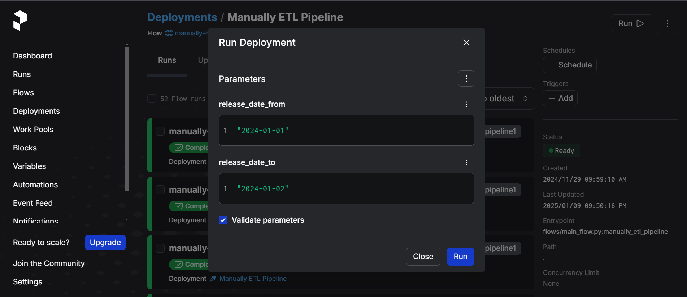

# ETL-Data-Pipeline-for-Aspect-Based-Sentiment-Analysis  

## Table of Contents :pushpin:
- [Overview](#overview)  
- [Prerequisites](#prerequisites)  
- [Features](#features)  
- [Installation](#installation)  
    - [Set up Environment](#set-up-environment)  
    - [Run Your Data Pipeline](#run-your-data-pipeline)  
    - [Dashboard](#power-bi-dashboard)  
- [Future Work](#future-work)  
- [Contributors](#contributors)  

---

## Overview  

This project presents a robust **ETL (Extract, Transform, Load) data pipeline** tailored for developing an **Aspect-Based Sentiment Analysis (ABSA)** model. By leveraging reviews from IMDB and detailed metadata from The Movie Database (TMDB) API, the pipeline automates the collection, transformation, and storage of movie data in a structured, accessible format.  

### Key Objectives
1. Automate data workflows for scalability and efficiency.  
2. Enable detailed sentiment analysis using ABSA techniques.  
3. Provide interactive visual insights through Power BI dashboards.  

### Project Structure  
- **Data Sources**:  
  - **IMDB**: Provides user reviews for aspect-based analysis.  
  - **TMDB**: Supplies metadata, including genres, cast, crew, and popularity scores.  

- **Data Pipeline**:  
  1. **Extract**: Fetch reviews from IMDB and metadata from TMDB.  
  2. **Transform**: Clean, preprocess, and enhance data using Python scripts.  
  3. **Load**: Store transformed data into PostgreSQL for analysis and visualization.  

- **Visualization**:  
  Leverage Power BI to design insightful dashboards, enabling stakeholders to explore trends and sentiment dynamics visually.  

### Design Architecture  
This project integrates modern tools for a seamless data pipeline:
- **Docker**: Ensures portability and easy deployment.  
- **Prefect**: Manages orchestration and task scheduling.  

Steps:  
1. **Extraction**: Retrieve raw reviews and metadata from APIs.  
2. **Staging**: Store raw data in **MongoDB Atlas** as the staging area.  
3. **Transformation**: Clean and process data in Python.  
4. **Storage**: Load structured data into **PostgreSQL**.  
5. **Visualization**: Build and update dashboards with Power BI.  

  

### Data Schema  
The project adopts a relational schema capturing key relationships among entities such as movies, reviews, actors, and directors.  
  

---

## Prerequisites  

To set up and run the pipeline, ensure you have the following:  
- **TMDB API Key**: Obtain your API key from [The Movie Database](https://developer.themoviedb.org/docs/getting-started).  
- **Docker**: Install Docker Desktop, including Docker Compose ([Download Docker](https://www.docker.com/products/docker-desktop/)).  
- **MongoDB Atlas Account**: Register for free [here](https://www.mongodb.com/cloud/atlas/register).  

---

## Features  

The project implements two distinct pipelines:  
1. **Manual ETL Pipeline**:  
   - Designed for fetching historical data based on user-defined date ranges (`release_date_from`, `release_date_to`).  
   - Triggered manually through the Prefect UI.  

2. **Automated ETL Pipeline**:  
   - Runs automatically every 7 days.  
   - Updates weekly data and fetches reviews for the top 10 most popular movies based on TMDB popularity scores.  

---

## Installation  

### Set up Environment   
1. Clone this repository:
```bash
git clone https://github.com/NgHuyn/ETL-Data-Pipeline-for-ABSA.git
cd ETL-Data-Pipeline-for-ABSA
```
2. Create a .env file based on the provided template:
```bash
cp env_template .env
```
Fill in the required details as per the [Prerequisite](#prerequisite).

3. Build Docker images:
```bash
make build
```
> Note: if you don't have WSL (Ubuntu) in your terminal, you can install it to use `make-`. Or just use the corresponding replace statement in the [Makefile](./Makefile)

**If you encounter issues, restart Docker or remove the existing image and try again.**

This process might take a few minutes, so just chill and take a cup of coffee :coffee:

4. Start the system:
```bash
make up
```

5. Verify services:
    1. Prefect
        - [`localhost:4200`](http://localhost:4200/): Prefect Server
    2. pgAdmin
        - [`localhost:5050`](http://localhost:5050/): pgAdmin
  

### Run your data pipeline
We use [Prefect](https://www.prefect.io/) to build our data pipeline. When you check out port `4200`, you'll see
prefect UI, let's go to Deployment section, you'll see 2 deployments there correspond to 2 data pipelines
#### Pipeline 1 (Manually ETL Pipeline)
- Use this pipeline to fetch historical data.
- Trigger it manually by entering the desired date range.
<div style="display: flex; justify-content: space-between;">




</div>

#### Pipeline 2 (ETL pipeline)
- Runs automatically every 7 days to update movie data and reviews.
- Initially fetches all movie data; subsequently, it updates the top 10 most popular movies weekly.

<div style="display: flex; justify-content: space-between;">


### Power BI Dashboard

> You can also see it in [powerbi_dashboard](./dashboard/powerbi_dashboard.pdf)

## Future Work
Planned updates include:
- Aspect-Based Sentiment Analysis Model: Build and integrate ABSA models using movie reviews.
- Real-Time Updates: Implement near-real-time review analysis.
- Advanced Visualization: Create dynamic visualizations for movie trends and audience sentiment.
## Contributors
<table>
  <tbody>
    <tr>
      <td align="center" valign="top" width="14.28%"><a href="https://github.com/NgHuyn"><br /><sub><b>Nguyen Hai Ngoc Huyen</b></sub></a><br /> Data Analyst </td>
      <td align="center" valign="top" width="14.28%"><a href="https://github.com/KimThy13"><br /><sub><b>Ta Hoang Kim Thy</b></sub></a><br /> Data Analyst </td>
    </tr>
  </tbody>
</table>
