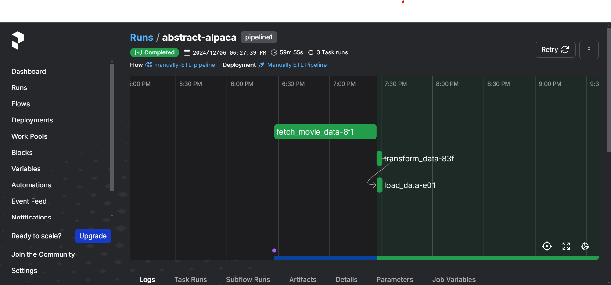

# Automated Data Pipeline Platform for Movie Analytics 🎥

## Table of Contents :pushpin:
- [Overview](#overview)  
- [Prerequisites](#prerequisites)  
- [Features](#features)  
- [Installation](#installation)  
    - [Set up Environment](#set-up-environment)  
    - [Run Your Data Pipeline](#run-your-data-pipeline)  
    - [Dashboard](#power-bi-dashboard)  
- [Future Work](#future-work)  
- [Contributors](#contributors)  

---

## Overview  

This project presents a robust **ETL (Extract, Transform, Load)** data pipeline tailored for developing an **Aspect-Based Sentiment Analysis (ABSA)** model. By leveraging reviews from IMDB and detailed metadata from The Movie Database (TMDB) API, the pipeline automates the collection, transformation, and storage of movie data in a structured, accessible format. 

### Key Objectives
1. Automate data workflows for scalability and efficiency.  
2. Enable detailed sentiment analysis using ABSA techniques.  
3. Provide interactive visual insights through Power BI dashboards.  

### Project Structure  
- **Data Sources**:  
  - **IMDB**: Provides user reviews for aspect-based analysis.  
  - **TMDB**: Supplies metadata, including genres, cast, crew, revenue, and popularity... 

- **Data Pipeline**:  
  1. **Extract**: Fetch reviews from IMDB and metadata from TMDB.  
  2. **Transform**: Clean, preprocess, and enhance data using Python scripts.  
  3. **Load**: Store transformed data into PostgreSQL for analysis and visualization.  

### Design Architecture  
This project integrates modern tools for a seamless data pipeline:
- **Docker**: Ensures portability and easy deployment.  
- **Prefect**: Manages orchestration and task scheduling.  

Steps:  
1. **Extraction**: Retrieve raw reviews and metadata from APIs.  
2. **Staging**: Store raw data in **MongoDB Atlas** as the staging area.  
3. **Transformation**: Clean and process data in Python.  
4. **Storage**: Load structured data into **PostgreSQL**.  
5. **Visualization**: Build and update dashboards with Power BI.  

  

### Data Schema  
The project adopts a relational schema capturing key relationships among entities such as movies, reviews, actors, and directors.  
  

---

## Prerequisites  

To set up and run the pipeline, ensure you have the following:  
- **TMDB API Key**: Obtain your API key from [The Movie Database](https://developer.themoviedb.org/docs/getting-started).  
- **Docker**: Install Docker Desktop, including Docker Compose ([Download Docker](https://www.docker.com/products/docker-desktop/)).  
- **MongoDB Atlas Account**: Register for free [here](https://www.mongodb.com/cloud/atlas/register).  

---
## Features  

The project implements two distinct pipelines:  
1. **Manual ETL Pipeline**:  
   - Designed for fetching historical data based on user-defined date ranges (`release_date_from`, `release_date_to`).  
   - Triggered manually through the Prefect UI.  

2. **Automated ETL Pipeline**:  
    - **Run Frequency**: Automatically triggers every 7 days.
    - **Functionality**:
      1. **Add New Movies**:
         - Fetches data (reviews, genres, cast, crew, and other metadata) for movies released in the past 7 days and integrates them into the database.
      2. **Targeted Updates for Popular Movies**:
         - Prioritizes updating reviews for the **top 10 most popular movies** from the past 7 days (based on `popularity` scores).
         - After completing these updates, recalculates and updates the new list of the top 10 popular movies.
---

## Installation  

### Set up Environment   
1. Clone this repository:
```bash
git clone https://github.com/NgHuyn/ETL-Data-Pipeline-for-ABSA.git
cd ETL-Data-Pipeline-for-ABSA
```
2. Create and Configure the `.env` file:
```bash
cp env_template .env
```
Populate the `.env` file with the required details as per the [Prerequisites](#prerequisites):
```
# The Movie Database
TMDB_API_KEY=<your-tmdb-api-key>

# MongoDB
MONGODB_USER=<your-mongodb-user>
MONGODB_PASSWORD=<your-mongodb-password>
MONGODB_SRV=<your-mongodb-server>
MONGODB_DATABASE=<your-mongodb-database>
MONGO_URI=<your-mongodb-uri>

# PostgreSQL
POSTGRES_USER=<your-postgres-user>
POSTGRES_PASSWORD=<your-postgres-password>
POSTGRES_DB=<your-postgres-database>
POSTGRES_HOST=postgres_container
POSTGRES_PORT=5432

# pgAdmin
PGADMIN_DEFAULT_EMAIL=<your-pgadmin-email>
PGADMIN_DEFAULT_PASSWORD=<your-pgadmin-password>

# Schedule
ANCHOR_DATE=<your-schedule> 
TIMEZONE=<your-timezone> 
```
> Note:
> - For `pgAdmin`, you can set any email and password.
> - The `ANCHOR_DATE` and `TIMEZONE` is used for scheduling Pipeline 2. If left unset, it defaults to `2024-11-29 10:00:00` with the `Asia/Saigon` timezone.

3. Build Docker images:
```bash
make build
```
> Note: If you don’t have make installed, you can use the corresponding commands in the [Makefile](./Makefile). **If you encounter issues, restart Docker or remove existing images and try again.**

The build process may take a few minutes—grab a cup of coffee while you wait! :coffee:

4. Start the system:
```bash
make up
```

5. Verify services:
    1. Prefect
        - [`localhost:4200`](http://localhost:4200/): Prefect Server
    2. pgAdmin
        - [`localhost:5050`](http://localhost:5050/): pgAdmin
    3. PostgreSQL
        - [`localhost:4200`](http://localhost:5432/): PostgreSQL

> Note: We use `pgAdmin` for managing and interacting with our `PostgreSQL` databases.

### Run your data pipeline
This project uses [Prefect](https://www.prefect.io/) to build and manage the data pipelines. Navigate to the Prefect UI on port `4200` to monitor and manage deployments, you'll see 2 deployments there correspond to 2 data pipelines:
#### Pipeline 1 (Manually ETL Pipeline)
- **Purpose**: Fetch historical data for a specified date range.

- **How to Run**: Trigger it manually by entering the desired date range in the Prefect UI.
  
  **Example UI for Pipeline 1**:
<div style="display: flex; justify-content: space-between;">




</div>

#### Pipeline 2 (ETL pipeline)
- **Purpose**: Automatically updates movie data and reviews every 7 days.

- **Initial Run**: Fetches all movie data and reviews.

- **Subsequent Runs**:

    - Updates the top 10 most popular movies based on popularity.

    - Fetches new reviews for these 10 movies from the past 7 days.

  **Example UI for Pipeline 2**:
<div style="display: flex; justify-content: space-between;">


### Power BI Dashboard

> Dashboard could be viewed in [powerbi_dashboard](./dashboard/movie_dashboard.pdf)

## Future Work
Planned updates include:

- **Aspect-Based Sentiment Analysis Model**: Build and integrate ABSA models using movie reviews to extract fine-grained sentiment insights.

- **Enhanced Movie Updates**: Expand update coverage to include movie details such as revenue, popularity, and more, in addition to reviews.

- **Comprehensive Updates**: Apply updates to all movies in the database, not just the top 10 most popular movies.

- **UI for Model Deployment**: Develop a user-friendly interface for deploying sentiment analysis models.
## Contributors
<table>
  <tbody>
    <tr>
      <td align="center" valign="top" width="14.28%"><a href="https://github.com/NgHuyn"><br /><sub><b>Nguyen Hai Ngoc Huyen</b></sub></a><br /> Data Analyst </td>
      <td align="center" valign="top" width="14.28%"><a href="https://github.com/KimThy13"><br /><sub><b>Ta Hoang Kim Thy</b></sub></a><br /> Data Analyst </td>
    </tr>
  </tbody>
</table>
